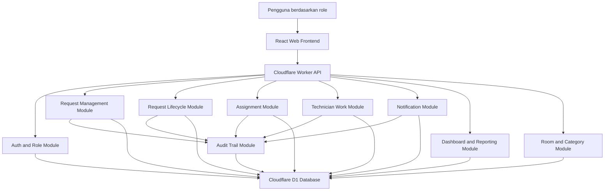
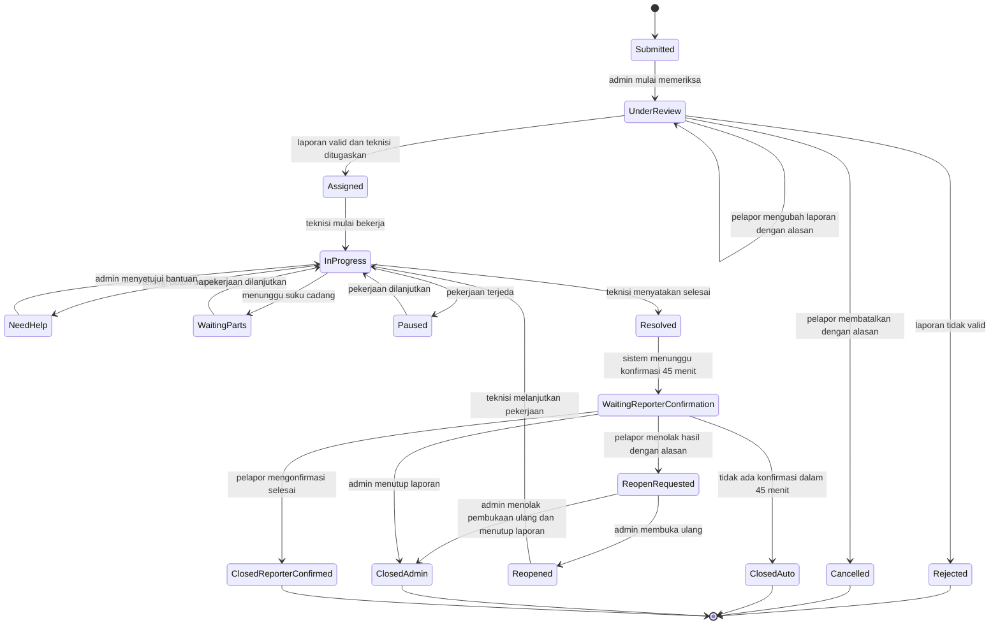

# 06 Architecture Design

## Nama Proyek
Campus Service Request and Maintenance System

## Sumber Input
- `docs/requirements/03-requirement-specification.md`
- `docs/requirements/04-requirement-prioritization.md`
- `docs/requirements/05-requirement-validation.md`
- `docs/requirements/05-change-impact-analysis.md`
- `CASE.md`

## Ringkasan Arsitektur
Sistem menggunakan arsitektur aplikasi web berbasis React, Cloudflare Workers, dan Cloudflare D1. React menangani antarmuka pengguna untuk pelapor, administrator, teknisi, dan Manajer Fasilitas. Cloudflare Worker menangani API, validasi role, lifecycle laporan, notifikasi aplikasi, audit trail, dashboard, laporan ringkas, dan export CSV. Cloudflare D1 menyimpan data utama sistem.

ASUMSI: Pada tahap desain ini, autentikasi akun kampus dibuat sebagai modul autentikasi internal atau simulasi role terlebih dahulu sampai integrasi akun kampus nyata ditentukan.

ASUMSI: Fitur foto ditiadakan sepenuhnya dari sistem untuk meminimalkan kebutuhan storage dan kompleksitas teknis.

## Tujuan Arsitektur
1. Mendukung alur utama laporan dari pembuatan sampai penutupan.
2. Menjaga pemisahan role pelapor, administrator, teknisi, dan Manajer Fasilitas.
3. Menyimpan riwayat status, alasan, komentar, dan keputusan penting.
4. Mendukung laporan ringkas, dashboard, dan export CSV.
5. Tetap sesuai scope awal Cloudflare Workers dan D1 tanpa storage file tambahan.
6. Menjadi dasar untuk tahap database design, API design, UI design, issue planning, dan testing.

## Komponen Utama

| Komponen | Tanggung Jawab | Requirement Terkait |
| --- | --- | --- |
| Web Frontend | Menyediakan halaman dan interaksi pengguna untuk semua role melalui browser desktop dan ponsel. | NFR-006 |
| Auth and Role Module | Mengatur login, role pengguna, dan pembatasan akses fitur. | FR-001, NFR-001, NFR-003 |
| Request Management Module | Membuat, melihat, mengubah, membatalkan, memeriksa, menolak, dan menutup laporan. | FR-002 sampai FR-009, FR-016, FR-021, FR-031 sampai FR-034 |
| Request Lifecycle Module | Mengelola status laporan, transisi status, konfirmasi pelapor, penutupan otomatis, pembukaan ulang, dan status akhir. | FR-012, FR-014, FR-018 sampai FR-021, FR-036 |
| Assignment Module | Menugaskan teknisi, menambah teknisi saat butuh bantuan, dan mengganti teknisi dengan persetujuan teknisi lama dan baru. | FR-010, FR-011, FR-015, FR-040 |
| Technician Work Module | Mengelola progress teknisi, status pekerjaan, dan estimasi waktu. | FR-012, FR-014, FR-041 |
| Comment and Note Module | Menyimpan komentar pelapor, catatan progress admin, dan catatan tindak lanjut Manajer Fasilitas. | FR-013, FR-017, FR-043 |
| Notification Module | Membuat notifikasi aplikasi, riwayat notifikasi, dan status sudah dibaca. | FR-022, FR-023, FR-037, NFR-002 |
| Room and Category Module | Menyediakan kategori fasilitas dan daftar ruangan berdasarkan gedung dan lantai. | FR-005, FR-006, FR-030, FR-035 |
| Dashboard and Reporting Module | Menyediakan dashboard, laporan ringkas, filter, chart, dan export CSV. | FR-024 sampai FR-029, FR-042 |
| Audit Trail Module | Mencatat riwayat status, alasan perubahan, alasan pembatalan, alasan penolakan, edit admin, dan keputusan penting. | NFR-004 |
| D1 Database | Menyimpan data pengguna, laporan, ruangan, kategori, assignment, status history, komentar, notifikasi, dan laporan. | FR-003, NFR-004 |

## Hubungan Antar Komponen

## Alur Lifecycle Laporan

## Aturan Arsitektur Lifecycle
1. Laporan baru selalu dimulai dari `Submitted`.
2. Pemeriksaan administrator memindahkan laporan ke `UnderReview`.
3. Laporan tidak valid dapat menjadi `Rejected` atau ditutup admin setelah perubahan pelapor dinilai tidak valid.
4. Perubahan laporan oleh pelapor wajib mencatat alasan dan membuat laporan perlu validasi administrator.
5. Pembatalan laporan oleh pelapor wajib mencatat alasan dan menghasilkan status `Cancelled`.
6. Laporan valid dapat menjadi `Assigned` setelah teknisi ditugaskan.
7. Teknisi dapat mengubah status pekerjaan menjadi `NeedHelp`, `WaitingParts`, atau `Paused`.
8. Laporan selesai oleh teknisi masuk ke `Resolved`, lalu `WaitingReporterConfirmation`.
9. Jika pelapor tidak memberi konfirmasi dalam 45 menit, laporan menjadi `ClosedAuto`.
10. Jika pelapor menolak hasil pekerjaan, laporan menjadi `ReopenRequested` sampai administrator memutuskan.
11. Penggantian teknisi baru efektif setelah teknisi lama dan teknisi baru menyetujui.
12. Semua perubahan status penting harus masuk ke audit trail.

## Pembagian Role dan Akses

| Role | Akses Utama |
| --- | --- |
| Pelapor | Membuat laporan, melihat laporan miliknya, memberi komentar, mengubah laporan dengan alasan, membatalkan laporan dengan alasan, mengonfirmasi selesai, menolak hasil pekerjaan dengan alasan, dan melihat notifikasi. |
| Administrator | Melihat semua laporan, memeriksa validitas, menolak laporan, mengedit laporan dengan alasan, menugaskan teknisi, menyetujui bantuan teknisi, menggabungkan duplikat, mengajukan penggantian teknisi, membuka ulang laporan, dan menutup laporan. |
| Teknisi | Melihat tugasnya, memperbarui progress, mengubah status pekerjaan, menyertakan estimasi waktu, meminta bantuan, menyatakan selesai, dan memberi persetujuan penggantian teknisi. |
| Manajer Fasilitas | Melihat dashboard, laporan ringkas, export CSV, mengelola daftar ruangan, dan memberi catatan tindak lanjut. |

## Data Utama yang Dikelola

| Data | Isi Utama | Komponen Pemilik |
| --- | --- | --- |
| User | Identitas, role, status akun. | Auth and Role Module |
| Service Request | Judul, deskripsi, kategori, lokasi, urgensi, status, pelapor. | Request Management Module |
| Room | Gedung, lantai, nama ruangan. | Room and Category Module |
| Category | Nama kategori fasilitas. | Room and Category Module |
| Assignment | Teknisi utama, teknisi tambahan, riwayat assignment, persetujuan penggantian. | Assignment Module |
| Progress Update | Status pekerjaan, catatan teknisi, estimasi. | Technician Work Module |
| Comment | Komentar pelapor dan catatan tambahan. | Comment and Note Module |
| Notification | Penerima, pesan, status dibaca, waktu dibuat. | Notification Module |
| Audit Trail | Aktor, aksi, alasan, nilai sebelum, nilai sesudah, waktu. | Audit Trail Module |
| Report Summary | Data agregasi dashboard dan CSV. | Dashboard and Reporting Module |

## Keputusan Arsitektur

| ID | Keputusan | Alasan | Requirement Terkait |
| --- | --- | --- | --- |
| ADR-001 | Menggunakan React untuk frontend dan Cloudflare Worker sebagai API. | Sesuai referensi tugas dan struktur repo saat ini. | NFR-006 |
| ADR-002 | Menggunakan Cloudflare D1 sebagai database utama. | Sesuai target teknologi proyek dan cukup untuk data relasional laporan. | NFR-004 |
| ADR-003 | Meniadakan fitur foto dari scope versi awal. | Meminimalkan penggunaan storage file dan menyederhanakan data input. | FR-004, FR-041 |
| ADR-004 | Memisahkan lifecycle laporan dari request management. | Status laporan memiliki aturan kompleks dan perlu diuji terpisah. | FR-018 sampai FR-021, FR-036 |
| ADR-005 | Semua aksi penting masuk audit trail. | Diperlukan untuk alasan penolakan, perubahan, pembatalan, edit admin, dan assignment. | NFR-004 |
| ADR-006 | Export laporan ringkas menggunakan CSV. | Human review memutuskan CSV dan format ini mudah diuji. | FR-042 |
| ADR-007 | Penggantian teknisi memerlukan persetujuan teknisi lama dan baru. | Human review menetapkan kedua teknisi harus menyetujui. | FR-040 |
| ADR-008 | Notifikasi hanya di dalam aplikasi. | Sesuai scope awal dan NFR. | FR-022, FR-023, NFR-002 |

## Dampak ke Tahap Berikutnya

| Tahap Berikutnya | Dampak dari Arsitektur |
| --- | --- |
| 07 Database dan API Design | Perlu tabel untuk user, request, room, category, assignment, status history, audit trail, notification, comment, dan manager note. |
| 08 UI Design | Perlu halaman role-based, layout responsif, request detail, admin review, technician task, dashboard, dan notification center. |
| 09 Issue Planning | Issue dapat dikelompokkan per modul arsitektur dan prioritas Must/Should/Could. |
| 12 Test Planning | Perlu test lifecycle status, role access, audit trail, notification, assignment, dan export CSV. |
| 15 Deployment | Tidak membutuhkan layanan storage file tambahan karena fitur foto ditiadakan. |

## Risiko Arsitektur

| Risiko | Dampak | Mitigasi |
| --- | --- | --- |
| Lifecycle laporan terlalu kompleks | Implementasi status dan test dapat membingungkan. | Buat state machine eksplisit dan gunakan transition helper di API. |
| Role access tidak konsisten | Pengguna dapat mengakses fitur yang bukan haknya. | Semua endpoint memeriksa role melalui Auth and Role Module. |
| Audit trail tidak lengkap | Keputusan admin, teknisi, atau pelapor sulit ditelusuri. | Semua command penting wajib menulis audit trail dalam transaksi yang sama. |
| Penggantian teknisi tertahan | Assignment tidak berubah jika satu teknisi belum menyetujui. | Gunakan status `PendingTechnicianReplacementApproval` dan tampilkan notifikasi ke kedua teknisi. |
| Fitur foto ditiadakan | Tidak ada bukti visual dari pelapor/teknisi. | Pastikan deskripsi masalah dari pelapor dan penjelasan teknisi diisi dengan detail yang jelas. |
| Dashboard lambat jika data bertambah | Query agregasi dapat membebani D1. | Mulai dengan query sederhana dan tambahkan index pada tahap database design. |

## Traceability Arsitektur

| Komponen | Requirement Utama |
| --- | --- |
| Auth and Role Module | FR-001, NFR-001, NFR-003 |
| Request Management Module | FR-002 sampai FR-009, FR-031 sampai FR-034, FR-038, FR-039 |
| Request Lifecycle Module | FR-018 sampai FR-021, FR-036 |
| Assignment Module | FR-010, FR-011, FR-015, FR-040 |
| Technician Work Module | FR-012, FR-014, FR-041 |
| Notification Module | FR-022, FR-023, FR-037, NFR-002 |
| Dashboard and Reporting Module | FR-024 sampai FR-029, FR-042, FR-043 |
| Room and Category Module | FR-005, FR-006, FR-030, FR-035 |
| Audit Trail Module | FR-009, FR-013, FR-031 sampai FR-034, FR-038 sampai FR-040, FR-043, NFR-004 |

## Quality Check
- Komponen utama mendukung requirement prioritas.
- Setiap komponen memiliki tanggung jawab jelas.
- Hubungan antar komponen dijelaskan melalui diagram dan tabel.
- Keputusan arsitektur memiliki alasan.
- Risiko arsitektur dicatat.
- Tidak ada komponen di luar scope proyek.

## Human Review
Human review tahap architecture design sudah dilakukan oleh pengguna pada 1 Juli 2026.

## Keputusan Human Review
1. Pembagian komponen disetujui dan dinilai sesuai kemampuan tim serta waktu proyek.
2. Status lifecycle laporan sudah cukup jelas untuk dilanjutkan ke database dan API design.
3. Asumsi autentikasi internal atau simulasi role dapat diterima untuk versi awal.
4. Keputusan untuk meniadakan fitur foto sudah disetujui.
5. Export CSV sudah cukup untuk kebutuhan laporan ringkas.

Tidak ada pertanyaan architecture design yang masih terbuka pada tahap ini.
